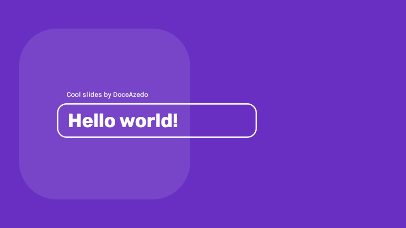
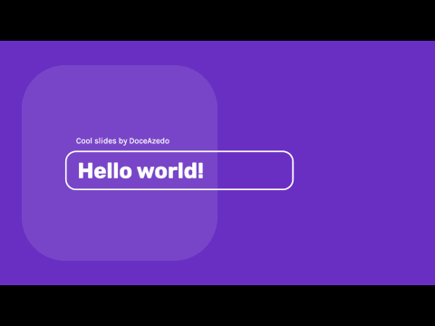
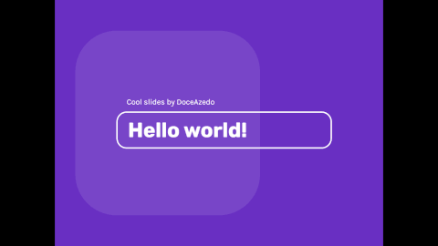

# Slides

Test for presenting slides within a SvelteKit app with no dependencies. This **might** be the predecessor of a fully-fledged slides web application in the future. For now this is just for experimentation.

✨ If you want to have a fixed aspect ratio for your slides, transitions still work great on screens with different ratios:

|  |  |
| :---------------------------------: | :--------------------------------: |
|      16:9 slides on 4:3 screen      |     4:3 slides on 16:9 screen      |
